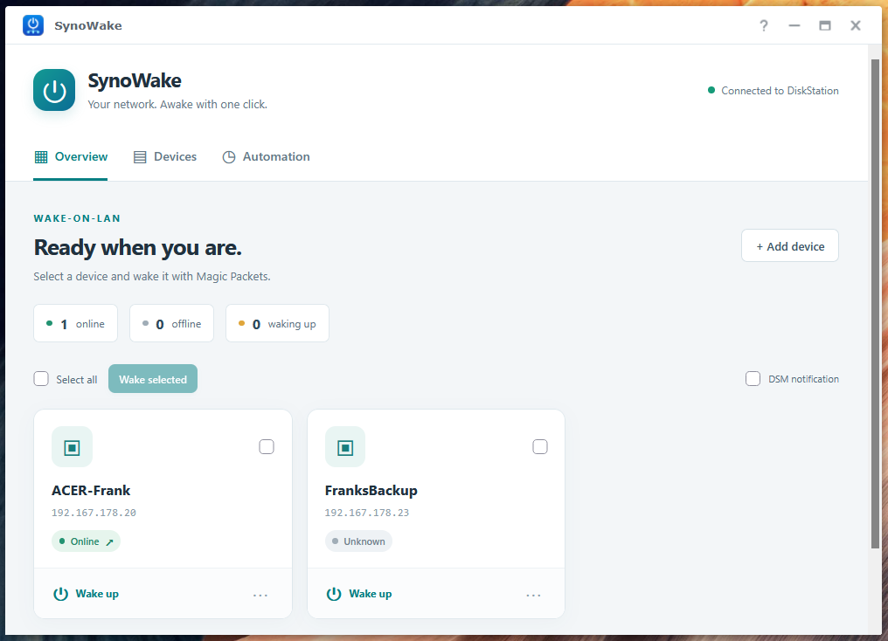
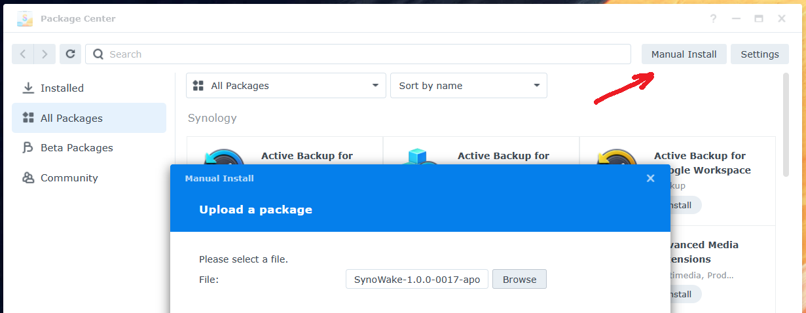
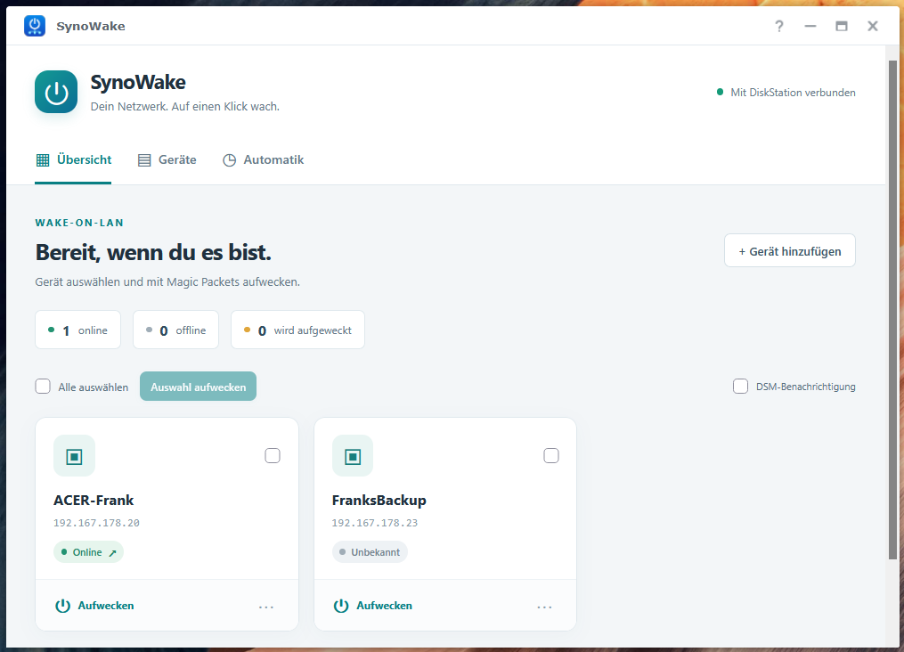
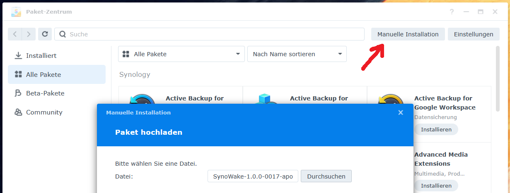

# SynoWake • Wake-on-LAN from Symology-DSM

Home: <https://geheimniswelten.github.io/#synowake>

  
<b>[EN] English</b>

  - Install the [SynoWake*.spk](https://github.com/geheimniswelten/SynoWake/releases) "manually" via Package Center
  - and from now on, wake up devices directly from within DSM :)
  - DSM 7.x with Intel-CPU (no ARM)

  
  
  

---

  
<b>[DE] Deutsch</b>

  - [SynoWake*.spk](https://github.com/geheimniswelten/SynoWake/releases) installieren
  - und direkt aus dem DSM heraus Geräte aufwecken :)
  - DSM 7.x mit Intel-CPU (kein ARM)

  

  

